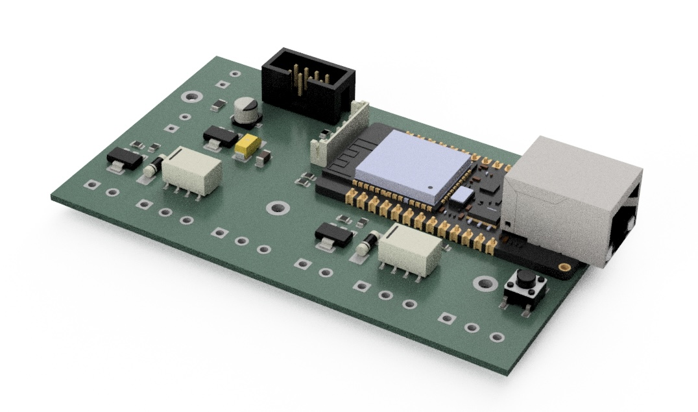
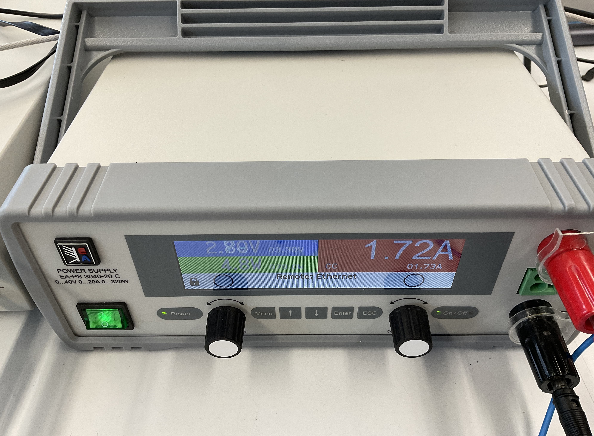
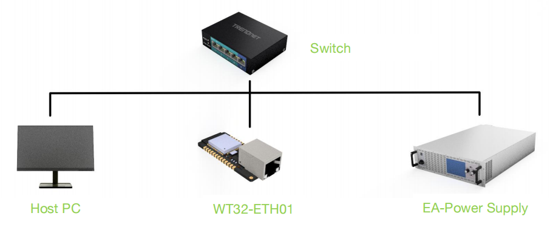
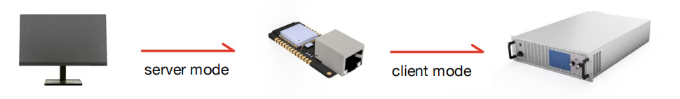
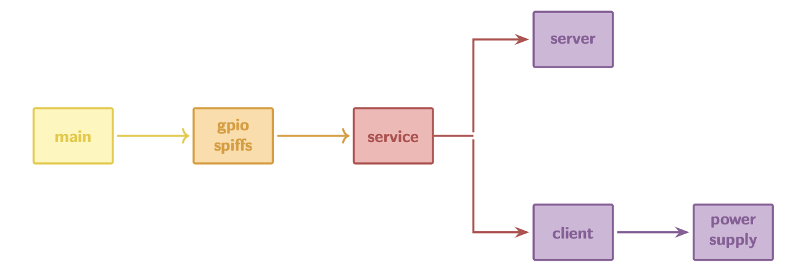
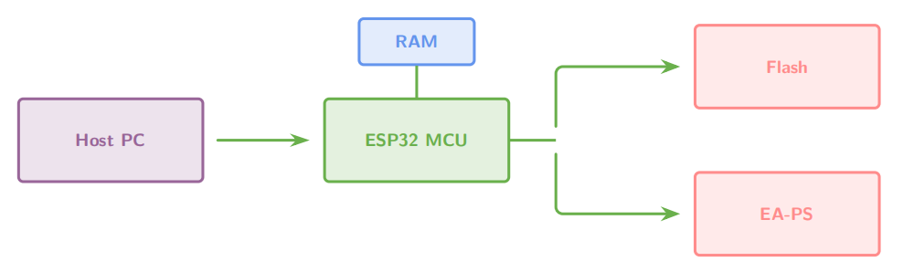

# ESP32 Application for MPI System

## 📖 Overview
This repository contains the implementation of my **Bachelor’s Thesis** at **TU Braunschweig (EMG Institute)**, supervised by **Dr.-Ing. Thilo Viereck**.  

**Thesis Title:**  
*ESP32-Based Relay Extension for a Bipolar Current Source with Modbus TCP*  

### Goals
- ✅ Develop a **C program** for the ESP32 (ESP-IDF environment)  
- ✅ Develop a **Python program** for the host PC  
- ✅ Validate the system with an oscilloscope  

### Context
At the EMG Institute, an **MPI (Magnetic Particle Imaging)** system is used.  
It requires three bidirectional magnetic fields:  

- **Drive Field (DF)**  
- **Focus Field (FF)**  
- **Selection Field (SF)**  

FF and SF are quasi-static → typically powered by bipolar current sources.  
To reduce cost → a **unipolar power supply + ESP32 + relays** can be used.  

In this project, we use:  
- **EA Power Supply** as the unipolar current source (supports Modbus TCP)  
- **ESP32** as the microcontroller  

---

## 🖧 Network Topology

- Communication: **Ethernet (Modbus TCP)**  

- ESP32 operates in **both**:  
  - Modbus TCP **Server mode** (receives commands from PC)  
  - Modbus TCP **Client mode** (controls EA Power Supply)  

---

## ⚙️ Program Structure

### Initialization
- Configure GPIOs: relay pins + crystal oscillator pin  
- Initialize **SPIFFS file system** → stores configuration in JSON format  
  - Runtime: config in RAM  
  - Flash: persistent JSON backup  

### Server Mode
- Register Modbus **callback functions** for different function codes  
- Define **parameter areas** and **structs**  
- Runtime values stored in RAM  

### Client Mode
- Functions for **read/write** to the EA Power Supply  
- Additional protection: **slew-rate limiter**, **interlock**  

### FreeRTOS Task
- A background task continuously polls the power supply  
- Ensures **real-time data synchronization**  

---

## 🔄 Program Logic

1. **Host PC → ESP32 (Server Mode)**  
   - ESP32 parses the received command  

2. **Command Type**  
   - **Read ESP32 / Power Supply** → return value from RAM  
   - **Write ESP32** → update struct + return response  
   - **Write Power Supply** → ESP32 switches to Client Mode, forwards command, returns response  

---

## 📊 Results

