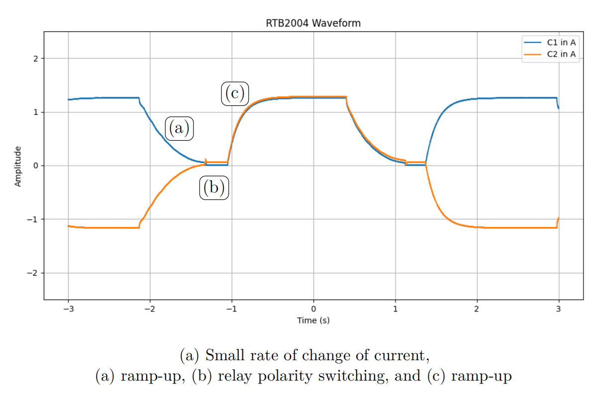
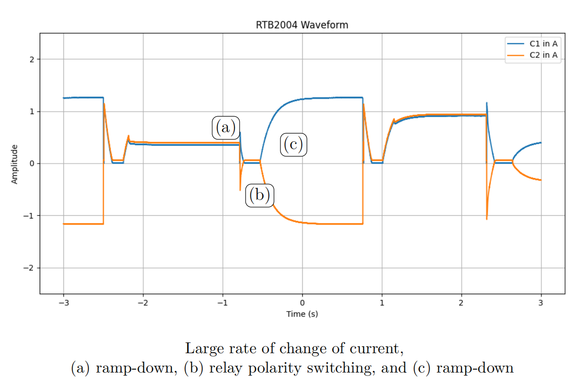

# ESP32 Application for MPI System

## 1. Overview
This repository contains the implementation of my **Bachelor’s Thesis** at **TU Braunschweig ([EMG Institute](https://www.tu-braunschweig.de/emg))**, supervised by **[Dr.-Ing. Thilo Viereck](https://www.tu-braunschweig.de/emg/institut/team/dr-ing-thilo-viereck)**.  

**Thesis Title:**  
*ESP32-Based Relay Extension for a Bipolar Current Source with Modbus TCP*  

    

### 1.1 Goals
- ✅ Develop a **C program** for the ESP32 (ESP-IDF environment)  
- ✅ Develop a **Python program** for the host PC  
- ✅ Validate the system with an oscilloscope  

### 1.2 Context
At the EMG Institute, an **MPI (Magnetic Particle Imaging)** system is used.  
It requires three bidirectional magnetic fields:  

- **Drive Field (DF)**  
- **Focus Field (FF)**  
- **Selection Field (SF)**  

FF and SF are quasi-static → typically powered by bipolar current sources.  
To reduce cost → a **unipolar power supply + ESP32 + relays** can be used.  

In this project, we use:  
- **EA Power Supply** as the unipolar current source (supports Modbus TCP)  
- **ESP32** as the microcontroller  
  

    

---

## 2. Hardware Design

The PCB design is kept simple by directly using the **WT32-ETH01 development board**, which integrates:  
- An **ESP32 module**  
- An **Ethernet interface (LAN)**  
- An **onboard LDO** for power regulation  
- **Two onboard relays** for switching operations  

This approach avoids complex custom PCB design and ensures reliable Ethernet + relay control for Modbus TCP applications.  

The following figure shows how a **DPDT (Double Pole Double Throw) relay** is used to reverse the current direction through the load:

- **Pins 3 & 6** → Connected to the **load**  
- **Pins 2 & 5** → Connected to **VDD**  
- **Pins 4 & 7** → Connected to **GND**  
- **Pins 1 & 8** → Relay **coil pins** (activation control)  

By toggling the relay coil, the current direction through the load can be switched:

- Relay **OFF** → Load connected in one polarity  
- Relay **ON** → Load polarity reversed  

---

## 3. System Topology

### 3.1 Network Topology
- Communication: **Ethernet (Modbus TCP)**  

### 3.2 Logical Topology
- ESP32 operates in **both**:  
  - Modbus TCP **Server mode** (receives commands from PC)  
  - Modbus TCP **Client mode** (controls EA Power Supply)  

---

## 4. Program

### 4.1 Program Flow

#### Initialization
- Configure GPIOs: relay pins + crystal oscillator pin  
- Initialize **SPIFFS file system** → stores configuration in JSON format  
  - Runtime: config in RAM  
  - Flash: persistent JSON backup  

#### Server Mode
- Register Modbus **callback functions** for different function codes  
- Define **parameter areas** and **structs**  
- Runtime values stored in RAM  

#### Client Mode
- Functions for **read/write** to the EA Power Supply  
- Additional protection: **slew-rate limiter**, **interlock**  

#### FreeRTOS Task
- A background task continuously polls the power supply  
- Ensures **real-time data synchronization**  

### 4.2 Program Logic

1. **Host PC → ESP32 (Server Mode)**  
   - ESP32 parses the received command  

2. **Command Types**  
   - **Read ESP32 / Power Supply** → return value from RAM  
   - **Write ESP32** → update struct + return response  
   - **Write Power Supply** → ESP32 switches to Client Mode, forwards command, returns response  

---

## 5. Results

### 5.1 Slew-rate and voltage spikes

In the code, we defined a **slew rate limiter**. This is necessary because our circuit contains a large inductor.  
According to **Faraday’s law**: *u = L · di/dt*.  

When the relay switches, we need to bring the current down to zero. If the current drops too quickly, it will cause an excessively high reverse voltage.  

Therefore, we added a protection method in the function: instead of directly setting the current from *10 A → 0 A*, we gradually reduce it step by step (*10 A, 9 A, …, 1 A, 0 A*).  

Oscilloscope measurements confirmed the effectiveness of this method.

### 5.2 Test Scenarios

- **Write valid voltage**  
  - Command: `10 V`  
  - Expected behaviour: outputs 10 V, OK response  
  - Result: **Pass**

- **Over-voltage attempt**  
  - Command: `42 V`  
  - Expected behaviour: Reject + exception code  
  - Result: **Pass**

- **Current inversion**  
  - Command: `–5 A → +10 A`  
  - Expected behaviour: Ramp + relay switch + delayed response  
  - Result: **Pass**

- **Relay protection**  
  - Command: `Switch relay while I ≠ 0`  
  - Expected behaviour: Relay state locked, no switching until *I = 0*  
  - Result: **Pass**

- **Long-time test**  
  - Command: `Continuous operation, 5 hours`  
  - Expected behaviour: Stable, no error observed  
  - Result: **Pass**
